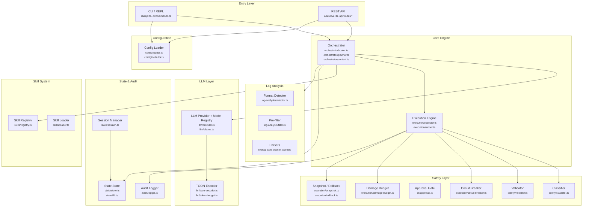
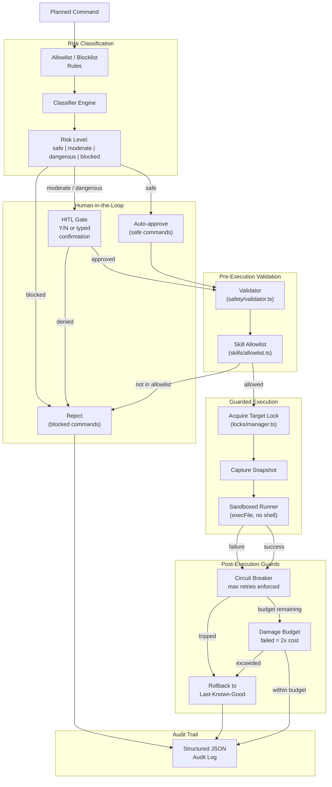
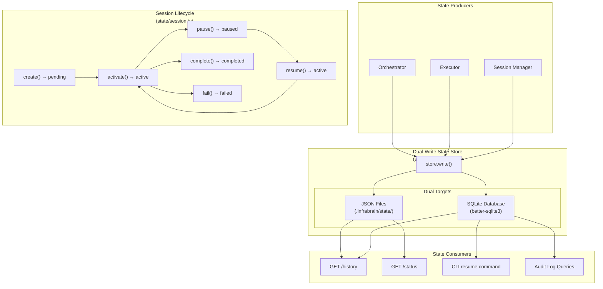
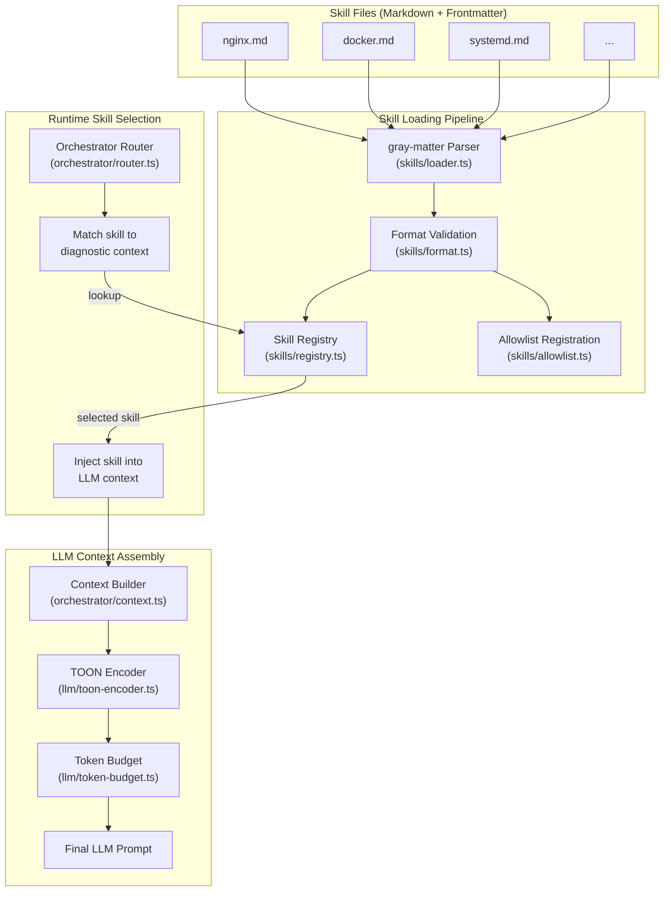

# InfraBrain Architecture

This document describes the architecture of InfraBrain, an LLM-powered infrastructure debugging and remediation system. It exposes both a CLI (Commander-based REPL) and a REST API (Express 5), backed by an orchestration engine that diagnoses issues, plans fixes, and executes them under strict safety controls.

**Tech Stack:** TypeScript 5.9, Node.js (ESM), AI SDK v6 + Ollama, better-sqlite3, Express 5, Commander, Zod v4, Vitest.

---

## 1. System Overview

The system is composed of six major subsystems: the entry layer (CLI + API), the orchestrator, the execution engine, the safety layer, state management, and the skill system.

### Component Responsibilities

| Subsystem | Purpose |
|-----------|---------|
| **Entry Layer** | Accepts user input via interactive REPL or HTTP endpoints. Both converge on the orchestrator. |
| **Orchestrator** | Routes requests to skills, builds LLM context, generates fix plans via `generateObject` + Zod schemas. |
| **Execution Engine** | Runs commands in a sandboxed `child_process.execFile`, with circuit breaking, damage budgets, and rollback. |
| **Safety Layer** | Classifies command risk, validates against allowlists/blocklists, gates on human approval, and enforces budgets. |
| **State & Audit** | Dual-write store (JSON files + SQLite) for sessions and fix plans; structured audit log for every action. |
| **Skill System** | Loads markdown skill files (gray-matter), registers them, and injects relevant skills into LLM context. |
| **Log Analysis** | Auto-detects log formats, parses them, and pre-filters before sending to the LLM for diagnosis. |
| **LLM Layer** | Multi-model registry with domain-expertise routing (default/strategic/forensic roles). Abstracted provider interface (AI SDK v6) with Ollama implementation, TOON encoding for context compression, and token budget tracking. Skills declare `preferred_model` for role-based routing. |

---

## 2. Data Flow: Diagnose-Plan-Execute-Verify Loop

The core operational loop takes a user's debug request through four phases: diagnosis, planning, execution, and verification. Sessions persist across phases to support resume.

```mermaid
flowchart LR
    subgraph Input
        REQ["Debug Request<br/>(CLI or API)"]
    end

    subgraph Diagnose["Phase 1: Diagnose"]
        SESS["Create / Resume<br/>Session"]
        LOGS["Detect + Parse<br/>Log Format"]
        FILT["Pre-filter Logs"]
        SKILL["Select Skill<br/>(Router)"]
        DISC["Run Discovery<br/>(docker ps, network ls)"]
        CTX["Build LLM Context<br/>(TOON Encoded +<br/>Discovery Data)"]
        DIAG["LLM Diagnosis<br/>(generateObject)"]
    end

    subgraph Plan["Phase 2: Plan"]
        PLAN["Generate Fix Plan<br/>(Zod-validated steps)"]
        RISK["Classify Risk<br/>per Step"]
        GATE["Human Approval<br/>(if high-risk)"]
    end

    subgraph Execute["Phase 3: Execute"]
        SNAPS["Capture Snapshot"]
        RUN["Run Command<br/>(sandboxed execFile)"]
        BUDGET["Check Damage<br/>Budget"]
        BREAK["Circuit Breaker<br/>Check"]
    end

    subgraph Verify["Phase 4: Verify"]
        CHECK["Verify Fix<br/>(re-diagnose)"]
        ROLL["Rollback if<br/>Verification Fails"]
        DONE["Mark Session<br/>Complete"]
    end

    REQ --> SESS --> LOGS --> FILT --> SKILL --> DISC --> CTX --> DIAG
    DIAG --> PLAN --> RISK --> GATE
    GATE --> SNAPS --> RUN --> BUDGET --> BREAK
    BREAK -->|"pass"| CHECK
    BREAK -->|"tripped"| ROLL
    CHECK -->|"fixed"| DONE
    CHECK -->|"not fixed"| ROLL
    ROLL -->|"retry?"| PLAN
```

### Phase Details

1. **Diagnose** -- A session is created (or resumed from prior state). Logs are auto-detected (`detector.ts`), parsed by format-specific parsers, and pre-filtered. The orchestrator's router selects the most relevant skill. **Before the LLM call**, the Discovery Engine runs READ-only commands (`docker ps`, `docker network ls`) to gather ground truth about the live system. This discovery data is TOON-encoded and injected into the LLM prompt alongside the skill context, preventing hallucination of container names, network names, etc. The LLM returns a structured diagnostic result via `generateObject`.

2. **Plan** -- The planner generates a fix plan as a sequence of steps, each validated against a Zod schema. Every step's command is classified by risk level (safe / moderate / dangerous). High-risk steps require explicit human approval via the approval gate.

3. **Execute** -- Before each command, a state snapshot is captured. The runner executes commands via sandboxed `execFile`. The damage budget tracks cost (failed commands cost 2x). The circuit breaker halts execution if retries or budget are exhausted.

4. **Verify** -- After execution, the system re-diagnoses to verify the fix. If verification fails, automatic rollback restores the last-known-good snapshot. The loop can retry from the Plan phase if budget allows.

---

## 3. Safety Architecture

Every command passes through multiple safety gates before execution and is monitored during and after execution.

### Safety Layers Explained

| Layer | Module | Purpose |
|-------|--------|---------|
| **Classification** | `safety/classifier.ts`, `safety/rules.ts` | Categorizes every command into a risk level using pattern-matched allowlists and blocklists. |
| **Validation** | `safety/validator.ts`, `skills/allowlist.ts` | Confirms the command is valid for the current context and permitted by the active skill's allowlist. |
| **Approval** | `cli/approval.ts` | Safe commands auto-approve. Moderate/dangerous commands require explicit human confirmation (Y/N or typed string). Blocked commands are always rejected. |
| **Target Locking** | `locks/manager.ts` | File-based locks prevent concurrent operations on the same target. Supports force-override for recovery. |
| **Snapshot** | `execution/snapshot.ts` | Captures system state before each command so rollback is possible. |
| **Circuit Breaker** | `execution/circuit-breaker.ts` | Halts execution after max retries. Budget-aware: will not retry if damage budget is near exhaustion. |
| **Damage Budget** | `execution/damage-budget.ts` | Tracks cumulative execution cost. Failed commands consume 2x their cost. Execution stops when budget is exceeded. |
| **Rollback** | `execution/rollback.ts` | Restores system to the last-known-good snapshot when verification fails or budgets are exceeded. |
| **Audit** | `audit/logger.ts` | Every action (approved, denied, executed, rolled back) is written to a structured JSON audit log. |

---

## 4. State Management

InfraBrain uses a dual-write pattern: every state mutation is written to both a JSON file (human-readable, git-friendly) and a SQLite database (queryable, indexed).

### State Types

| Type | Defined In | Description |
|------|-----------|-------------|
| **Session** | `state/types.ts` | Top-level container for a debug interaction. Tracks lifecycle state, target, timestamps. |
| **FixPlan** | `state/types.ts` | The ordered sequence of steps generated by the planner. Attached to a session. |
| **ResumeMetadata** | `state/types.ts` | Captures the exact point of interruption so execution can resume from where it left off. |
| **AuditEntry** | `audit/types.ts` | Immutable log entry for every significant event. Queryable via `store.ts` audit log queries. |

### Why Dual-Write?

- **JSON files** are human-readable, diffable, and can be committed to version control for traceability.
- **SQLite** enables efficient queries (history, filtering by time/status), indexing, and supports the resume workflow where the system needs to quickly locate interrupted sessions.
- Both are written atomically within the same store operation to ensure consistency.

---

## 5. Skill System

Skills are markdown files that define domain-specific knowledge for the LLM. They are loaded at startup, registered in a lookup table, and selected at runtime by the orchestrator's router based on the diagnostic context.

### Skill File Structure

Each skill is a markdown file with YAML frontmatter (parsed by `gray-matter`). The frontmatter defines metadata (name, tags, target types), and the body contains the domain knowledge and diagnostic instructions injected into the LLM prompt.

### Skill Selection Flow

1. **Load** -- At startup, `skills/loader.ts` reads all skill files, parses frontmatter with gray-matter, validates structure via `skills/format.ts`.
2. **Register** -- Parsed skills are stored in `skills/registry.ts` (a lookup table keyed by name and tags). Each skill's permitted commands are registered in `skills/allowlist.ts`.
3. **Route** -- At runtime, `orchestrator/router.ts` examines the diagnostic context (log patterns, target type, error signatures) and selects the most relevant skill from the registry.
4. **Inject** -- The selected skill's content is passed to `orchestrator/context.ts`, which assembles the full LLM prompt. The TOON encoder compresses the context to fit within the token budget tracked by `llm/token-budget.ts`.

---

## API Surface

### REST Endpoints

| Method | Path | Handler | Description |
|--------|------|---------|-------------|
| GET | `/health` | `api/routes/health.ts` | Liveness check |
| POST | `/debug` | `api/routes/debug.ts` | Start a debug session (auto-detects resume) |
| POST | `/execute` | `api/routes/execute.ts` | Execute a fix plan |
| GET | `/status` | `api/routes/status.ts` | Current session status |
| GET | `/history` | `api/routes/history.ts` | Query past sessions |
| POST | `/resume` | `api/routes/resume.ts` | Resume an interrupted session |

All API responses use the JSON envelope format (`cli/json-envelope.ts`): `{ ok: boolean, command: string, data?: T, error?: string }`.

### CLI Commands

| Command | Module | Description |
|---------|--------|-------------|
| `debug` | `cli/commands.ts` | Start an interactive debug session |
| `status` | `cli/commands.ts` | Show current session status |
| `history` | `cli/commands.ts` | Browse past sessions |
| `execute` | `cli/commands.ts` | Execute the fix plan from last diagnosis |
| `resume` | `cli/commands.ts` | Resume an interrupted session |
| (REPL) | `cli/repl.ts` | Interactive mode with live formatting |

---

## Key Design Decisions

1. **Dual-write state** -- JSON files for human readability and git diffability; SQLite for efficient querying and resume support. Both are written atomically.

2. **TOON encoding** -- Token-Oriented Object Notation compresses structured data before sending it to the LLM, maximizing the useful information within token budgets.

3. **Damage budget with 2x failure cost** -- Failed commands are penalized at double the cost of successful ones, creating a natural bias toward caution and early termination of failing plans.

4. **Skill-scoped allowlists** -- Each skill defines which commands it is permitted to run. Commands outside the active skill's allowlist are rejected regardless of their general risk classification.

5. **Sandboxed execution** -- Commands run via `execFile` (not `exec`), avoiding shell injection. No shell interpretation occurs.

6. **Resume-first sessions** -- Sessions capture enough metadata to resume from the exact point of interruption, making the system resilient to crashes, timeouts, and manual pauses.

7. **Iterative Discovery** -- Before the LLM generates a diagnosis or fix plan, the system runs READ-only discovery commands (e.g., `docker ps`, `docker network ls`) to gather ground truth. Discovery results are TOON-encoded and injected into the LLM context, eliminating hallucination of container names, network names, and other infrastructure artifacts.

8. **Model-agnostic platform** -- InfraBrain benchmarks and swaps models per scenario. The `IntelligenceCatalog` maps problem domains to optimal models. Current IT-Ops champion: Qwen 2.5 Coder 32B. Results tracked in `MODEL_LEADERBOARD.md`.
