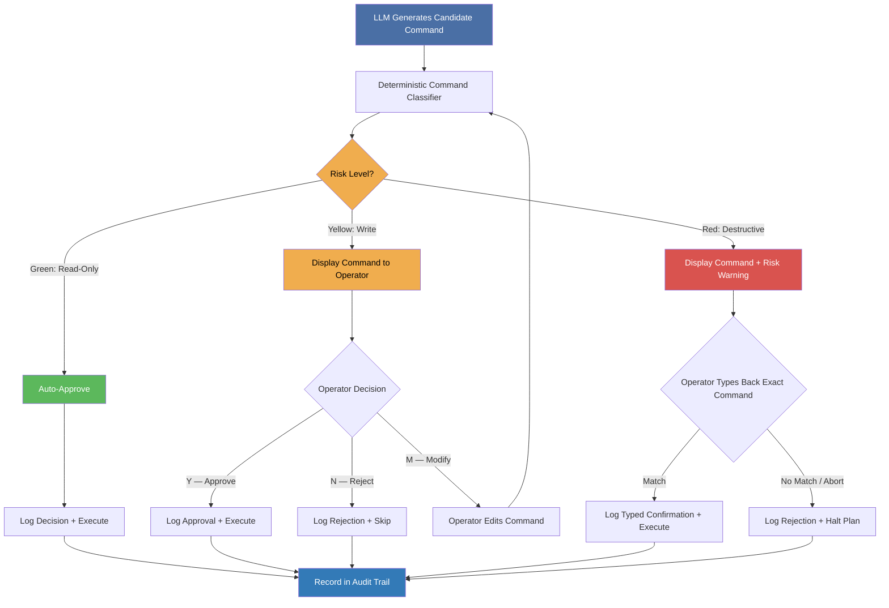
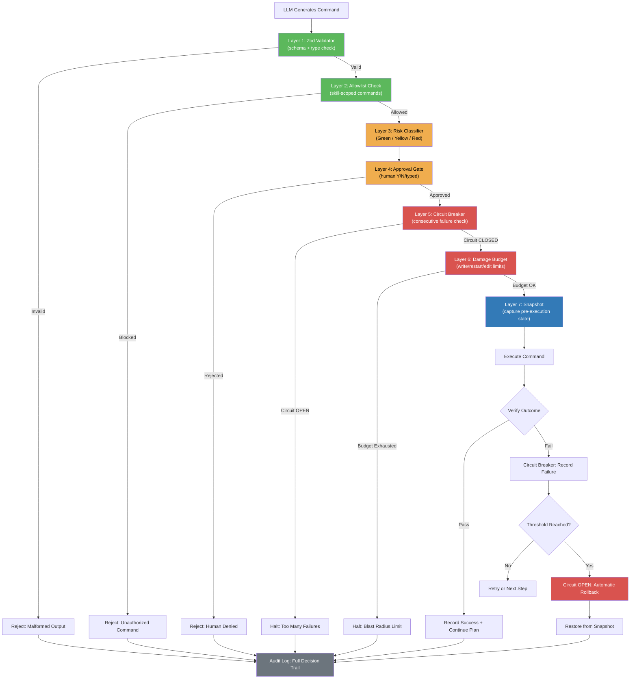
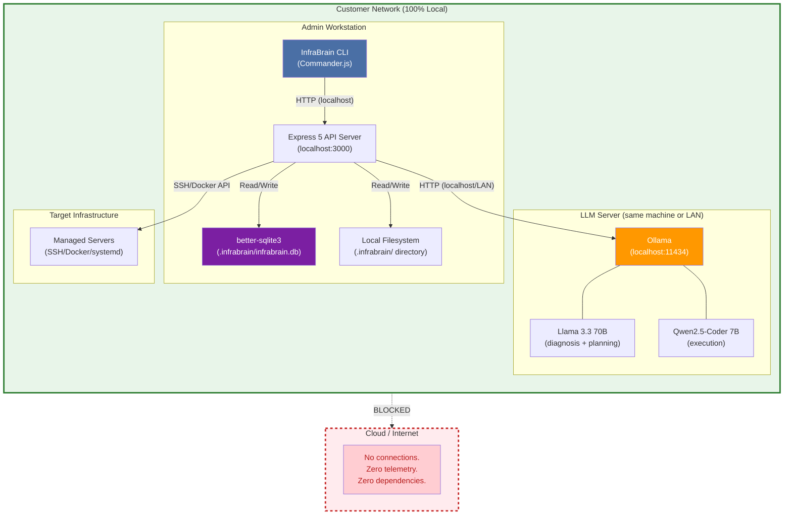
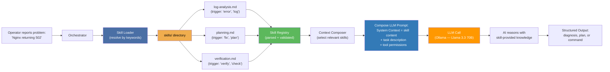
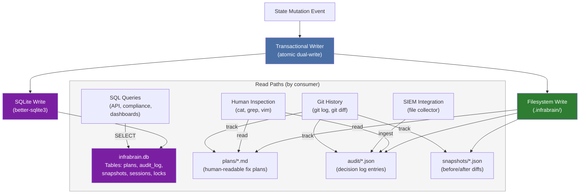
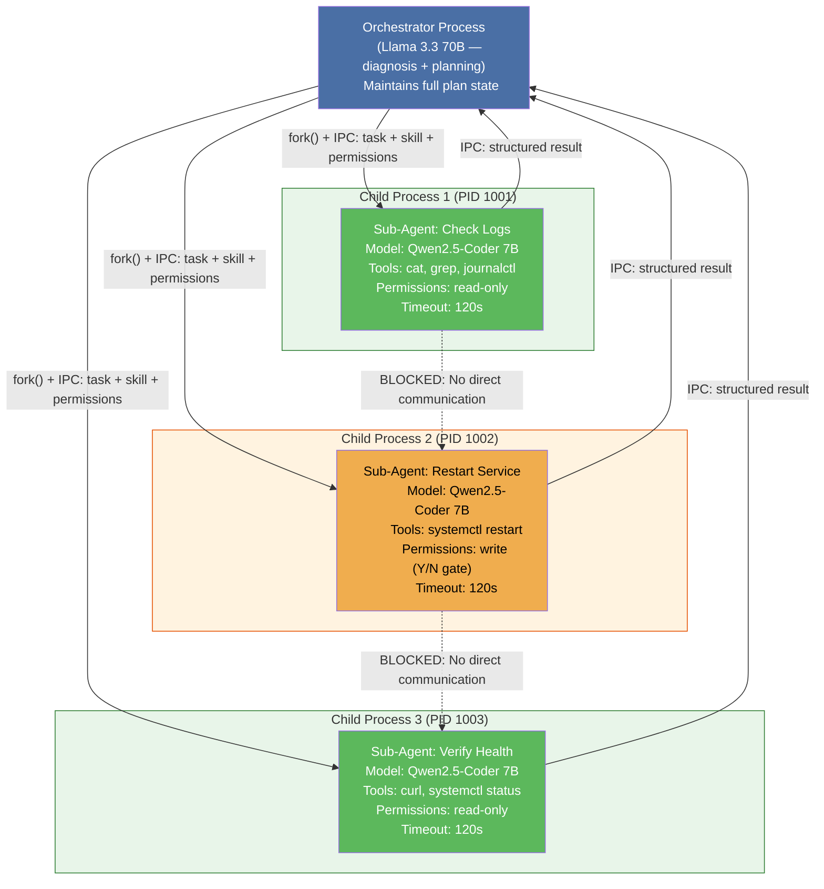
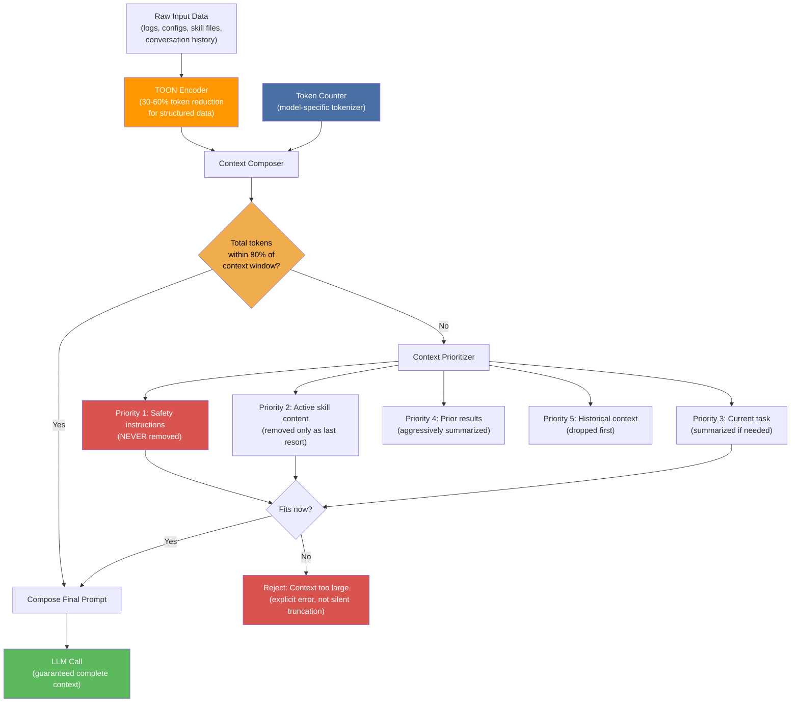
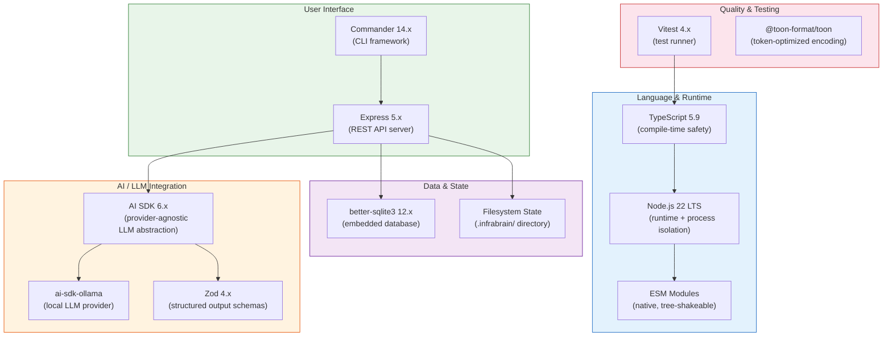
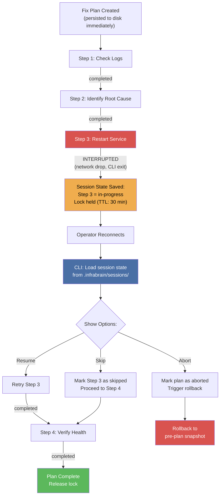

# InfraBrain — Architecture Decision Records

**Product:** InfraBrain — On-Premise AI IT Operations Platform
**Version:** 1.0
**Last Updated:** 2026-03-08
**Classification:** Internal / Customer-Facing / Regulatory

> InfraBrain diagnoses, plans, and fixes infrastructure problems using local LLMs.
> Human always in the loop. Runs 100% locally via Ollama. Zero cloud dependencies.

---

## Table of Contents

- [ADR-001: Human-in-the-Loop Safety Architecture](#adr-001-human-in-the-loop-safety-architecture)
- [ADR-002: Defense-in-Depth Safety Net](#adr-002-defense-in-depth-safety-net)
- [ADR-003: On-Premise / Zero-Cloud Architecture](#adr-003-on-premise--zero-cloud-architecture)
- [ADR-004: Composable Skill System](#adr-004-composable-skill-system)
- [ADR-005: Dual-Write State Management](#adr-005-dual-write-state-management)
- [ADR-006: Sub-Agent Isolation](#adr-006-sub-agent-isolation)
- [ADR-007: Token Budget and Context Management](#adr-007-token-budget-and-context-management)
- [ADR-008: Technology Stack Selection](#adr-008-technology-stack-selection)
- [ADR-009: Session Resumability](#adr-009-session-resumability)
- [ADR-010: Controversy Resolution — AI Operating on Production Infrastructure](#adr-010-controversy-resolution--ai-operating-on-production-infrastructure)

---

## ADR-001: Human-in-the-Loop Safety Architecture

**Status:** Accepted
**Date:** 2026-03-08

**Context:**

The EU AI Act (Regulation 2024/1689), specifically Article 14, mandates human oversight for high-risk AI systems. InfraBrain operates on critical IT infrastructure — servers, databases, network configurations — where an unreviewed command can cause outages, data loss, or security breaches. Enterprise customers (banks, government agencies, German Mittelstand) require demonstrable proof that no AI-generated command executes without appropriate human authorization. The risk profile of infrastructure commands varies enormously: reading a log file is harmless, restarting a service is disruptive, and deleting a volume is potentially catastrophic. A single approval model for all commands is either too permissive (dangerous) or too restrictive (unusable).

**Decision:**

Implement a three-tier approval gate system based on command risk classification:

| Tier | Risk Level | Approval Requirement | Examples |
|------|-----------|---------------------|----------|
| **Green** (Read) | None | Auto-approved, logged | `cat`, `grep`, `docker ps`, `systemctl status`, `curl`, `df -h` |
| **Yellow** (Write) | Moderate | Explicit Y/N confirmation | `docker restart`, `systemctl restart`, `config file edits` |
| **Red** (Destructive) | High | Typed confirmation (command echoed back) | `rm`, `docker rm -f`, `DROP TABLE`, `iptables -F`, volume deletion |

Every command — including auto-approved green commands — is recorded in the audit log with timestamp, classification rationale, and outcome. The classification is performed by a deterministic rule engine (Zod-validated allowlists and pattern matching), not by the LLM. The LLM generates candidate commands; a separate, non-AI system classifies and gates them.

**Consequences:**

- No destructive action can ever execute without the human typing back the exact command. This eliminates the "runaway AI" risk entirely.
- Read-only operations flow without friction, keeping the diagnostic experience fast.
- Full audit trail satisfies SOC 2 Type II logging requirements and EU AI Act Article 14 human oversight mandates.
- The classification engine is deterministic and testable — not subject to LLM hallucination.
- Trade-off: multi-step fix plans require multiple approval prompts, which slows execution. This is an intentional design choice — safety over speed.

**Industry Questions Addressed:**

- **Q: "How do you prevent the AI from executing dangerous commands?"**
  A: The AI never executes commands directly. It generates candidate commands that pass through a deterministic classifier and a human approval gate. Destructive commands require the operator to type back the exact command text. The approval system is not AI-powered — it is a rule engine with Zod-validated allowlists, making it auditable and immune to prompt injection.

- **Q: "Is this EU AI Act compliant?"**
  A: Yes. Article 14 requires that high-risk AI systems "can be effectively overseen by natural persons." InfraBrain exceeds this requirement: every write and destructive operation requires explicit human approval before execution, every action is logged with full provenance, and the human can reject, modify, or abort at any point. The system provides the "ability to not use the AI system" (Article 14(3)(d)) at every step — the operator can always skip AI recommendations and act manually.



---

## ADR-002: Defense-in-Depth Safety Net

**Status:** Accepted
**Date:** 2026-03-08

**Context:**

Human-in-the-loop approval (ADR-001) prevents intentionally dangerous commands but does not protect against cascading failures, commands that are individually safe but collectively destructive, or situations where a fix makes things worse. Production infrastructure requires multiple independent safety layers — no single mechanism should be the only thing preventing catastrophic damage. This follows the defense-in-depth principle from information security (ISO 27001) and resilience engineering (circuit breaker pattern from Michael Nygard's "Release It!").

**Decision:**

Implement seven independent safety layers, each capable of halting execution on its own:

| Layer | Mechanism | What It Catches |
|-------|-----------|-----------------|
| **1. Validator** | Zod schema validation of LLM output | Malformed commands, injection attempts, missing parameters |
| **2. Allowlist** | Deterministic command allowlist per skill | Commands the skill is not authorized to use |
| **3. Classifier** | Risk-level classification (Green/Yellow/Red) | Escalates dangerous commands to appropriate approval tier |
| **4. Approval Gate** | Human-in-the-loop (ADR-001) | Commands the human considers inappropriate |
| **5. Circuit Breaker** | Max consecutive failures (default: 3) | Repeated failures indicating the fix plan is wrong |
| **6. Damage Budget** | Max write operations, restarts, config edits per plan | Runaway execution that exceeds expected blast radius |
| **7. Snapshot + Rollback** | Pre-execution state capture, automatic restore on failure | Reverting changes when verification fails |

The circuit breaker follows the standard three-state pattern: CLOSED (normal operation), OPEN (halted after threshold failures), HALF-OPEN (single retry attempt after cooldown). When the circuit opens, all remaining plan steps are suspended, the operator is alerted, and automatic rollback to the last known-good snapshot is initiated.

The damage budget is configured per fix plan with sensible defaults (max 10 write operations, max 3 service restarts, max 5 config file edits). Each executed action decrements the budget. When exhausted, execution halts regardless of plan progress.

**Consequences:**

- A single bug, hallucination, or mistake cannot cause cascading damage — it will be caught by at least one layer.
- The system self-limits: even if a human approves a bad command, the circuit breaker and damage budget provide independent backstops.
- Automatic rollback means failed fixes leave infrastructure in its pre-fix state, not in a half-modified broken state.
- Trade-off: the multiple safety layers add latency to each execution step (validation, classification, budget check, snapshot). For production safety, this is acceptable.

**Industry Questions Addressed:**

- **Q: "What happens if the AI makes a mistake?"**
  A: Seven independent safety layers catch mistakes at different points. If the LLM generates a malformed command, the Zod validator catches it. If it generates a command outside the skill's scope, the allowlist catches it. If it generates a destructive command, the classifier escalates to human approval. If the human approves a command that fails, the circuit breaker halts after 3 consecutive failures and triggers automatic rollback to the pre-fix snapshot. At no point can a single mistake cascade into widespread damage.

- **Q: "How do you limit blast radius?"**
  A: The damage budget enforces hard limits on the total number of write operations, service restarts, and config changes per fix plan. These limits are configurable but have conservative defaults. Additionally, each sub-agent operates in process isolation (ADR-006), preventing one task's failure from affecting another. The combination of damage budget + circuit breaker + process isolation creates a bounded blast radius that is mathematically constrained, not just hoped for.



---

## ADR-003: On-Premise / Zero-Cloud Architecture

**Status:** Accepted
**Date:** 2026-03-08

**Context:**

InfraBrain's primary market includes European banks (ECB regulatory framework), government agencies (BSI IT-Grundschutz), healthcare providers (HIPAA equivalent), and German Mittelstand — organizations that legally cannot or will not send infrastructure telemetry, server configurations, log files, or operational data to external cloud services. GDPR Article 44 restricts data transfers outside the EU. The EU AI Act adds requirements for transparency and data governance for AI systems. Existing AIOps competitors (PagerDuty, BigPanda, Dynatrace Davis AI) are cloud-dependent, creating a market gap for organizations with strict data sovereignty requirements.

**Decision:**

InfraBrain executes 100% locally with zero cloud dependencies:

| Component | Local Implementation | Cloud Alternative (NOT used) |
|-----------|---------------------|------------------------------|
| LLM Inference | Ollama running locally (Llama 3.3 70B, Qwen2.5-Coder 7B) | OpenAI, Anthropic, Azure AI |
| Database | better-sqlite3 (embedded, file-based) | Cloud PostgreSQL, DynamoDB |
| State Storage | Local filesystem (`.infrabrain/` directory) | S3, Azure Blob Storage |
| API Server | Express 5 on localhost | Cloud-hosted API gateway |
| Telemetry | None. Zero telemetry. Zero phone-home. | Analytics services, error reporting |
| Updates | Manual download or air-gapped transfer | Auto-update from cloud CDN |
| Skill Files | Local filesystem (`skills/` directory) | Cloud skill marketplace |

The architecture enforces this at the code level: there are no HTTP client calls to external services anywhere in the codebase except to `localhost` (Ollama API). This is verifiable by code audit.

**Consequences:**

- Complete data sovereignty: no infrastructure data, logs, configurations, or AI prompts ever leave the customer's network.
- GDPR-compliant by design: no data processing occurs outside the data controller's infrastructure.
- Air-gap deployable: InfraBrain can run in fully disconnected environments (military, classified networks).
- Trade-off: model quality is limited by what runs locally. Llama 3.3 70B requires significant GPU resources (40GB+ VRAM for quantized inference). Smaller models (7B-14B) run on consumer hardware but with reduced reasoning capability.
- Trade-off: no automatic updates. Security patches must be manually deployed.

**Industry Questions Addressed:**

- **Q: "Where does our data go?"**
  A: Nowhere. All data stays on your servers. InfraBrain makes zero network calls to external services. The LLM runs locally via Ollama, the database is a local SQLite file, and all state is stored in local files. You can verify this by running InfraBrain on an air-gapped network — it works identically. There is no telemetry, no analytics, no phone-home behavior of any kind.

- **Q: "GDPR compliance?"**
  A: InfraBrain is GDPR-compliant by architecture, not by policy. Since no data leaves the customer's infrastructure, Articles 44-49 (international data transfers) do not apply. The customer is both data controller and processor. The AI processing happens on the customer's own hardware using open-source models. There is no third-party data processing agreement required because there is no third party.



---

## ADR-004: Composable Skill System

**Status:** Accepted
**Date:** 2026-03-08

**Context:**

Every enterprise has unique infrastructure: proprietary monitoring tools, custom deployment pipelines, legacy systems with undocumented configurations. A hardcoded approach (Docker plugin, Nginx module, Kubernetes handler) fails to scale and locks the product into supporting specific technologies. Competitors face this problem differently: StackStorm requires Python packs (2,000+ in their community), Rundeck requires XML/YAML job definitions, and Ansible requires YAML playbooks — all demanding developer skill sets. InfraBrain needs an extensibility model that non-developers (senior sysadmins, IT managers) can use to teach the AI their specific systems.

**Decision:**

Implement a Markdown-based skill system inspired by obra/superpowers:

- Skills are `.md` files stored in the `skills/` directory.
- Each skill file contains structured sections: description, available tools/commands, diagnostic procedures, fix procedures, verification steps, and risk classifications.
- Skills are parsed at runtime using `gray-matter` (frontmatter) and `remark` (Markdown AST).
- The Skill Loader resolves which skills are relevant to the current task based on keyword matching and explicit skill references.
- Selected skill content is injected into the LLM prompt as system context, teaching the model how to work with that specific system.
- Skills define tool permissions (what commands the sub-agent is allowed to run), creating a security boundary.
- The engine core contains zero domain-specific IT knowledge — all knowledge lives in skills.

Skill file structure:
```markdown
---
name: analyzing-logs
triggers: [log, error, exception, stacktrace, journalctl]
risk: read-only
tools: [grep, cat, journalctl, docker logs, tail]
---

# Analyzing Logs

## When to Use
When the operator reports errors, exceptions, or unexpected behavior...

## Available Tools
- `journalctl -u <service> --since "1 hour ago"` — recent service logs
- `docker logs --tail 100 <container>` — container output
...

## Diagnostic Procedure
1. Identify which service is affected
2. Pull recent logs from that service
3. Look for error patterns...
```

**Consequences:**

- Any IT system can be supported by writing a Markdown file — no code changes to the engine.
- Senior sysadmins can author skills in natural language without programming experience.
- Skills are version-controllable (git), reviewable (pull requests), and auditable (plain text).
- Skill files define the security boundary: a skill that only lists `read-only` tools cannot be used to execute write operations.
- Trade-off: Markdown-based skills are less precise than code-based definitions. The LLM interprets the skill content, which introduces variability in how instructions are followed.
- Trade-off: skill quality depends on the author. Poorly written skills produce poor AI behavior.

**Industry Questions Addressed:**

- **Q: "How do we customize this for our systems?"**
  A: Write a Markdown file. If you have a proprietary monitoring tool called "InternalWatch," you create `skills/internalwatch.md` describing what commands are available, how to interpret the output, and what fix procedures apply. InfraBrain's engine reads this skill and teaches the AI your system without any code changes. Your sysadmins can write and maintain these skills — no developer required.

- **Q: "How extensible is it?"**
  A: Infinitely, within the domain of command-line infrastructure operations. Every skill is an independent Markdown file. New skills can be added, modified, or removed at any time without restarting the system. Skills can reference other skills for composition (e.g., "debug-webapp" references "analyzing-logs" and "check-docker-health"). The skill system is the same mechanism used for InfraBrain's built-in capabilities — there is no privileged internal API that custom skills cannot access.



---

## ADR-005: Dual-Write State Management

**Status:** Accepted
**Date:** 2026-03-08

**Context:**

Enterprise IT operations require two contradictory things: (1) structured, queryable data for compliance reporting, dashboards, and SIEM integration (`SELECT * FROM audit_log WHERE risk_level='high' AND timestamp > '2026-03-01'`), and (2) human-readable files that an admin can inspect at 3 AM during an incident without writing SQL (`cat .infrabrain/plans/2026-03-08-nginx-502.md`). Git-trackable state files also enable version control of operational history, a requirement for change management processes (ITIL). Neither SQLite alone nor filesystem alone satisfies both needs.

**Decision:**

All state mutations are written to both storage backends atomically:

| Storage | Format | Purpose | Consumers |
|---------|--------|---------|-----------|
| **SQLite** (better-sqlite3) | Structured tables | Queries, aggregation, SIEM export, dashboards | API endpoints, compliance reports, future web UI |
| **Filesystem** (`.infrabrain/`) | Markdown + JSON files | Human inspection, git tracking, manual audit | Admins, git history, text editors, `cat`/`grep` |

Directory structure:
```
.infrabrain/
  plans/              — FIX_PLAN.md files (human-readable fix plans)
  audit/              — Decision log entries (JSON + human summary)
  snapshots/          — Before/after state diffs per execution step
  locks/              — Active lock files (target exclusivity)
  sessions/           — Session state for resumability
  infrabrain.db       — SQLite database (structured mirror)
```

The write path uses a transactional wrapper: SQLite write + filesystem write succeed or both are rolled back. SQLite is the source of truth for queries; filesystem is the source of truth for human review. Both contain the same logical data in different formats.

**Consequences:**

- Admins can `cat` any state file to understand what happened, without tools or database clients.
- Compliance teams can run SQL queries for audit reports without parsing text files.
- The `.infrabrain/` directory can be committed to git, creating a version-controlled history of all operational decisions.
- SIEM integration is straightforward: export JSON audit entries or query SQLite directly.
- Trade-off: dual-write doubles the I/O for every state mutation. For the write volumes InfraBrain handles (tens to hundreds of entries per fix plan, not thousands per second), this is negligible.
- Trade-off: maintaining consistency between two storage backends adds implementation complexity.

**Industry Questions Addressed:**

- **Q: "How do we audit what the AI did?"**
  A: Every decision, command, approval, and outcome is recorded in both a queryable SQLite database and human-readable files. The audit trail includes: what the AI recommended, how it was classified (risk level), whether the human approved/rejected/modified it, the exact command executed, the before-state snapshot, the after-state result, and the verification outcome. You can query this via SQL for compliance reports or read the Markdown files directly for incident review.

- **Q: "Can we integrate with our SIEM?"**
  A: Yes. The audit log is stored in both SQLite (for SQL-based export) and JSON files (for file-based ingestion). Common SIEM integration patterns: (1) point your SIEM's file collector at `.infrabrain/audit/` for real-time JSON ingestion, (2) query the SQLite database on a schedule for structured export, or (3) use the REST API (Express 5) to pull audit entries programmatically. The data model includes timestamps, risk levels, command text, operator identity, and outcome — all fields a SIEM expects.



---

## ADR-006: Sub-Agent Isolation

**Status:** Accepted
**Date:** 2026-03-08

**Context:**

InfraBrain's fix plans consist of multiple sequential tasks (e.g., "check logs," "restart service," "verify health"). If these tasks share the same LLM conversation context, two problems emerge: (1) context contamination — Task 3's execution is influenced by irrelevant details from Task 1, causing hallucinated connections and wrong tool selections (the "context rot" problem documented in GSD and obra/superpowers), and (2) blast radius leakage — a misbehaving task could affect other tasks' execution environment. In IT operations, these are not theoretical risks: a task that reads a 500-line log file fills the LLM context window with noise that degrades all subsequent tasks.

**Decision:**

Each execution task runs in a separate Node.js child process (`child_process.fork()`) with its own:

| Isolation Boundary | Implementation | What It Prevents |
|-------------------|----------------|------------------|
| **LLM Context** | Fresh AI SDK conversation per child process | Context contamination between tasks |
| **Process Memory** | Separate V8 heap per child | Memory leaks in one task affecting others |
| **Tool Permissions** | Skill-scoped allowlist passed to child | One task using commands from another task's skill |
| **Timeout** | Configurable per-process kill timer (default: 120s) | Hung tasks blocking the entire plan |
| **Environment** | Restricted `env` object passed to child | Credential leakage between tasks |

The Orchestrator communicates with sub-agents via structured IPC (JSON over stdio). Sub-agents never communicate with each other directly — all inter-task data flows through the Orchestrator, which summarizes relevant results into a compact handoff (not the raw conversation history).

The Orchestrator runs diagnosis and planning in its own process using the large model (Llama 3.3 70B). Sub-agents use the smaller, faster model (Qwen2.5-Coder 7B) for execution reasoning.

**Consequences:**

- Each task gets a clean, focused LLM context window — no "context rot" from prior tasks.
- A crashed or hung sub-agent is killed without affecting the Orchestrator or other tasks.
- Process isolation provides a natural security boundary: sub-agents cannot access the Orchestrator's memory, database connections, or state.
- The Orchestrator maintains the "big picture" while sub-agents are disposable "hands" with narrow focus.
- Trade-off: process spawning adds ~50-100ms overhead per task. For multi-minute infrastructure operations, this is negligible.
- Trade-off: IPC serialization means large data (e.g., log file contents) must be passed as structured messages, adding complexity.

**Industry Questions Addressed:**

- **Q: "What prevents one task from affecting another?"**
  A: Operating system process isolation. Each task runs in a separate Node.js child process with its own memory space, LLM context, and tool permissions. There is no shared state between tasks — they cannot read each other's memory, files, or variables. The only communication channel is structured JSON messages through the Orchestrator. If Task 2 crashes, Task 3 is unaffected because they are literally separate OS processes.

- **Q: "How do you prevent lateral movement?"**
  A: Each sub-agent receives only the permissions defined by its task's skill file. A log-analysis task receives read-only tool permissions (`cat`, `grep`, `journalctl`) and cannot execute write commands even if the LLM hallucinates them — the allowlist is enforced at the process level, not by the LLM. Sub-agents have no access to the SQLite database, no access to other tasks' context, and no network access beyond what is explicitly required for their task. The attack surface of any single sub-agent is limited to the specific tools and targets defined in its skill.



---

## ADR-007: Token Budget and Context Management

**Status:** Accepted
**Date:** 2026-03-08

**Context:**

Local LLMs have strict context window limits (4K-128K tokens depending on model and quantization). Unlike cloud APIs that return clear "context length exceeded" errors, local models silently truncate input when the context window is exceeded — the model simply ignores the oldest tokens without any warning. This is catastrophic for IT operations: if the system prompt (containing safety instructions and skill content) is truncated, the LLM loses its safety constraints and domain knowledge. Infrastructure logs can easily exceed context limits: a single `journalctl` dump can contain 100K+ tokens. Without active context management, InfraBrain would silently degrade into an unconstrained, uninformed LLM generating random commands.

**Decision:**

Implement a token budget system with three mechanisms:

1. **Token Budget Enforcement:** Before every LLM call, count tokens in the composed prompt (system context + skill content + conversation history + user input). If the total exceeds 80% of the model's context window, the call is rejected with an explicit error rather than allowing silent truncation. The 80% threshold reserves space for the model's response.

2. **TOON Encoding:** Use the `@toon-format/toon` library to encode structured data (logs, configurations, system state) in a token-optimized notation that reduces token consumption by 30-60% compared to raw text or JSON. TOON encodes hierarchical data using indentation and compact syntax, preserving all information while minimizing token usage.

3. **Context Prioritization:** When the token budget is tight, the context composer prioritizes content in this order: (a) safety instructions (never truncated), (b) active skill content, (c) current task description, (d) relevant prior results (summarized), (e) historical context (dropped first).

| Mechanism | Purpose | Implementation |
|-----------|---------|----------------|
| Token counting | Prevent silent truncation | Pre-flight check before every LLM call |
| TOON encoding | Reduce token consumption | Encode structured data (logs, configs) in compact format |
| Context prioritization | Ensure critical content survives | Ordered priority: safety > skill > task > history |
| Log pre-filtering | Prevent log dumps from filling context | `grep`/`tail` before sending to LLM, never raw dumps |
| Result summarization | Compact inter-task handoffs | Orchestrator summarizes sub-agent results, not raw output |

**Consequences:**

- Silent truncation is impossible: the system either fits within the context window or explicitly fails with a clear error.
- TOON encoding extends the effective context window by 30-60%, allowing more skill content and log data per LLM call.
- Safety instructions are always in context — they cannot be pushed out by large log files or verbose skill definitions.
- Trade-off: token counting adds overhead to every LLM call. With local models, this is minimal (fast tokenizer lookup).
- Trade-off: TOON encoding requires encoding/decoding steps, adding ~5-10ms per structured data payload.

**Industry Questions Addressed:**

- **Q: "How do you handle context limits with local models?"**
  A: Three mechanisms. First, we enforce a token budget: every LLM call is pre-checked against the model's context window limit, and the call is rejected (not silently truncated) if it would exceed 80%. Second, we use TOON encoding to compress structured data by 30-60%, effectively extending the usable context window. Third, we prioritize context: safety instructions and skill content are always included; historical context and verbose logs are summarized or dropped. Infrastructure logs are pre-filtered (`grep`, `tail`) before reaching the LLM — we never send raw log dumps. The result: the LLM always operates with complete safety constraints and relevant domain knowledge, even on models with modest context windows (8K-32K tokens).



---

## ADR-008: Technology Stack Selection

**Status:** Accepted
**Date:** 2026-03-08

**Context:**

InfraBrain requires a technology stack that supports: local-first execution (no cloud dependencies), AI/LLM integration with local models, process isolation for sub-agents, embedded database for portable state, CLI-first interface, and single-binary distribution for enterprise deployment. The stack must be production-ready, well-maintained, and have a strong ecosystem for the long term.

**Decision:**

| Technology | Version | Role | Decision Rationale |
|------------|---------|------|-------------------|
| **TypeScript** | 5.9 | Language | Strong type system catches infrastructure-related bugs at compile time. Async/await maps naturally to LLM call patterns. Type inference reduces boilerplate while maintaining safety. Zod integration provides runtime validation that mirrors compile-time types. |
| **Node.js** | 22.x LTS | Runtime | LTS until April 2027. Built-in `child_process.fork()` for sub-agent isolation. Native ESM support. Single Executable Application (SEA) support for binary distribution. Non-blocking I/O for concurrent LLM calls and infrastructure commands. |
| **ESM** | Native | Module system | Future-proof module system. Required by modern dependencies (chalk 5, ora 8). Tree-shakeable for smaller binary distribution. |
| **AI SDK** | 6.x | LLM abstraction | Provider-agnostic: swap Ollama for vLLM or llama.cpp without code changes. Built-in structured output (Zod schemas), streaming, tool calling, and agent loops. 2.8M weekly npm downloads — battle-tested. |
| **ai-sdk-ollama** | 3.x | Ollama provider | Connects AI SDK to Ollama's local HTTP API. Supports tool calling, streaming, and structured output with local models. |
| **better-sqlite3** | 12.x | Database | Synchronous API eliminates callback complexity in CLI tools. Fastest Node.js SQLite binding. Embedded (no server process). Single-file database is trivially portable and backupable. |
| **Express** | 5.x | HTTP API | Mature, minimal, well-documented. Express 5 adds async error handling and modern routing. Serves the REST API that the CLI consumes. |
| **Commander** | 14.x | CLI framework | Lightweight, 14B+ weekly downloads. Simple subcommand model matches InfraBrain's command-driven design. |
| **Vitest** | 4.x | Testing | Vite-native, fast execution. TypeScript-first. Compatible with the ESM module system. |
| **Zod** | 4.x | Validation | TypeScript-first schema validation with static type inference. 14x faster than Zod 3. Used by AI SDK for structured LLM output — aligning the entire stack on one validation library. |

**Consequences:**

- Single language (TypeScript) across the entire stack reduces context switching and enables code sharing between CLI, API, and sub-agents.
- AI SDK's provider abstraction future-proofs against LLM backend changes (Ollama today, vLLM tomorrow).
- better-sqlite3's synchronous API simplifies the codebase but requires the native addon to be handled during binary packaging (SEA).
- Express 5 is well-understood by the Node.js ecosystem, simplifying hiring and maintenance.
- Trade-off: TypeScript/Node.js has higher memory usage than Rust/Go for long-running processes. For InfraBrain's use case (interactive CLI sessions, not high-throughput servers), this is acceptable.
- Trade-off: better-sqlite3 is a native addon requiring compilation or prebuilt binaries per platform. This adds build pipeline complexity.

**Industry Questions Addressed:**

- **Q: "Why not Python?"**
  A: Four reasons. (1) Process isolation: Node.js `child_process.fork()` provides clean sub-agent isolation with IPC — Python's multiprocessing has GIL complications and heavier overhead. (2) Binary distribution: Node.js SEA produces a single executable; Python packaging (PyInstaller, cx_Freeze) is notoriously fragile. (3) Type safety: TypeScript's compile-time type checking catches the class of bugs (wrong parameter types, missing fields) that are most dangerous in infrastructure automation. Python's type hints are advisory, not enforced. (4) AI SDK ecosystem: Vercel's AI SDK is the most mature provider-agnostic LLM abstraction available, with first-class Ollama support, structured output via Zod schemas, and built-in streaming. Python's equivalent (LangChain) is heavier and less stable. That said, Python excels at ML/data science — InfraBrain is an operations platform, not an ML platform.

- **Q: "Is this production-ready?"**
  A: Every component in the stack is production-proven at scale. Node.js 22 LTS is used by Netflix, PayPal, and LinkedIn. Express handles billions of requests daily across the industry. better-sqlite3 is used by Electron apps (VS Code, Slack) serving millions of users. AI SDK has 2.8M weekly npm downloads. TypeScript is used by 78% of the top 1,000 npm packages. The stack is not experimental — it is the established enterprise Node.js toolchain applied to a new domain.



---

## ADR-009: Session Resumability

**Status:** Accepted
**Date:** 2026-03-08

**Context:**

Infrastructure fix plans can involve multiple steps executed over minutes or hours. Real-world interruptions are common: network drops during SSH sessions, operators stepping away for a meeting, system reboots, or deliberate pauses to consult a colleague. If a fix plan cannot be resumed after interruption, the operator must restart from scratch — wasting time and potentially re-executing steps that already changed the system state. Additionally, individual steps may fail for transient reasons (network timeout, service not ready yet) and need to be retried without re-running the entire plan.

**Decision:**

Implement session resumability with the following guarantees:

| Capability | Implementation |
|------------|----------------|
| **Plan persistence** | Every fix plan is written to `.infrabrain/plans/` (Markdown) and SQLite immediately upon generation. The plan exists independently of the CLI session. |
| **Step-level state tracking** | Each plan step has a status: `pending`, `in-progress`, `completed`, `failed`, `skipped`. Status is updated in both SQLite and filesystem after every step. |
| **Resume from last checkpoint** | On reconnect, the CLI queries the current plan state and presents the operator with options: resume from the next pending step, retry the last failed step, skip the failed step, or abort the plan. |
| **Lock-based session ownership** | An active fix plan holds a lock on its target (e.g., "nginx-server-01"). If the CLI disconnects, the lock has a TTL (default: 30 minutes). On reconnect within the TTL, the operator reclaims the session. After TTL expiry, the lock is released and the plan can be resumed or abandoned. |
| **Idempotent step design** | Skills are encouraged to define idempotent operations where possible. The verification step after each action confirms the desired state regardless of whether the action was a first attempt or a retry. |

Session state file example (`.infrabrain/sessions/2026-03-08-nginx-502.json`):
```json
{
  "sessionId": "abc-123",
  "planId": "plan-456",
  "target": "nginx-server-01",
  "status": "interrupted",
  "currentStep": 3,
  "steps": [
    { "id": 1, "status": "completed", "action": "Check logs", "completedAt": "..." },
    { "id": 2, "status": "completed", "action": "Identify root cause", "completedAt": "..." },
    { "id": 3, "status": "failed", "action": "Restart nginx", "error": "Connection timeout", "failedAt": "..." },
    { "id": 4, "status": "pending", "action": "Verify health" }
  ]
}
```

**Consequences:**

- Operators can safely disconnect and reconnect without losing progress.
- Failed steps can be retried individually without re-running completed steps.
- The lock system prevents two operators from running conflicting fix plans on the same target simultaneously.
- The session state file is human-readable — an admin can inspect `.infrabrain/sessions/` to understand what is happening on any target.
- Trade-off: step-level state tracking adds a filesystem write + SQLite write after every step, introducing slight overhead.
- Trade-off: the TTL-based lock can cause confusion if the operator returns after the TTL expires and someone else has started a new session.

**Industry Questions Addressed:**

- **Q: "What happens if the network drops mid-fix?"**
  A: The fix plan and its current state are persisted to disk (both SQLite and filesystem) after every step. When the operator reconnects, InfraBrain shows the plan's current state: which steps completed, which failed, and which are pending. The operator can resume from the next pending step, retry the failed step, skip it, or abort the plan. No work is lost. The system is designed for the reality of infrastructure operations — interruptions happen, and the tool adapts to them rather than requiring a restart.

- **Q: "Can we retry a failed step without starting over?"**
  A: Yes. Each step in a fix plan is independently tracked. A failed step can be retried (re-executed with the same parameters), modified (operator edits the command before re-execution), or skipped (marked as skipped, proceed to the next step). The verification step confirms the desired end state regardless of how many attempts it took. This design follows the idempotency principle: running a step twice should produce the same result as running it once.



---

## ADR-010: Controversy Resolution — AI Operating on Production Infrastructure

**Status:** Accepted
**Date:** 2026-03-08

**Context:**

The fundamental question every investor, customer, and regulator asks: "Should AI be allowed to touch production infrastructure?" This is the elephant in the room for InfraBrain. The fear is real: an LLM hallucinating a destructive command on a production database. The headlines write themselves. But this fear ignores the current reality: humans already use automated tools (Ansible, Terraform, Helm, shell scripts) that execute commands on production infrastructure. These tools are deterministic but unintelligent — they follow instructions blindly, cannot detect when something is going wrong mid-execution, and require a human to write the exact right commands in advance. The question is not "should automation touch production?" (it already does) but "is intelligent automation with human oversight safer than unintelligent automation without it?"

**Decision:**

Position InfraBrain as a **highly skilled assistant** where the **human is always the final authority**:

| Principle | Implementation |
|-----------|----------------|
| **AI recommends, human decides** | The AI generates diagnosis, plans, and commands. The human reviews and approves every write operation. The AI never acts autonomously on write/destructive operations. |
| **Transparent reasoning** | Every recommendation includes the AI's reasoning chain: "I checked X, found Y, concluded Z, recommend W." The human can evaluate the logic, not just the conclusion. |
| **Progressive trust model** | Three autonomy levels, configurable per skill, per environment, per risk level: |

**Progressive Autonomy Levels (planned for v2):**

| Level | Name | Behavior | Use Case |
|-------|------|----------|----------|
| **1** | OBSERVE | AI reads and analyzes. No command execution. Reports findings only. | New deployment, unfamiliar system, audit mode |
| **2** | GUIDED | AI generates plans and commands. Human approves each step (Y/N/M). | Default mode. Standard operations. |
| **3** | AUTONOMOUS | Pre-approved skills execute without per-step confirmation. Circuit breaker and damage budget still active. | Mature skills on well-known systems where trust is established. Read-only operations. |

Even at the highest autonomy level:
- The circuit breaker halts execution after 3 consecutive failures.
- The damage budget limits total changes per plan.
- Destructive operations (Red tier) ALWAYS require human confirmation, regardless of autonomy level.
- All actions are fully audited.
- The human can intervene at any time.

**Comparison with Existing Production Automation:**

| Tool | Touches Production? | Intelligence | Human Oversight | Error Detection |
|------|-------------------|-------------|-----------------|-----------------|
| **Ansible** | Yes — executes arbitrary commands via SSH | None — follows playbook blindly | Pre-execution review of playbook | None — continues on error unless `failed_when` is defined |
| **Terraform** | Yes — creates/destroys infrastructure | None — follows declarative config | `terraform plan` review before `apply` | Partial — detects state drift but not logical errors |
| **Helm** | Yes — deploys to production Kubernetes | None — templates values into manifests | Manual chart review | None — deploys whatever you give it |
| **Shell scripts** | Yes — unlimited production access | None | None (unless manually added) | None |
| **InfraBrain** | Yes — with human approval per step | LLM reasoning — diagnoses novel problems, explains actions | Three-tier approval gate per command | Verification step after every action, circuit breaker on failure, automatic rollback |

**The safety argument:** InfraBrain is strictly safer than the tools already running in production today. Ansible executes without per-command approval. Terraform applies without per-resource confirmation. Shell scripts have no safety gates at all. InfraBrain adds three layers that none of these tools have: (1) per-command human approval, (2) automatic verification after every action, and (3) automatic rollback on failure.

**Consequences:**

- InfraBrain can be deployed alongside existing automation tools without replacing them. It adds an intelligence and safety layer.
- The progressive autonomy model allows customers to start conservatively (OBSERVE mode) and increase trust gradually based on demonstrated reliability.
- The comparison with existing tools reframes the conversation: the risk is not "AI on production" but "unintelligent automation on production without oversight."
- Trade-off: the conservative approach (GUIDED mode as default) means InfraBrain will not match the speed of fully autonomous systems. This is intentional — safety over speed for v1.
- Trade-off: positioning as an "assistant" may limit appeal to customers wanting fully autonomous self-healing infrastructure. The progressive autonomy roadmap addresses this for v2+.

**Industry Questions Addressed:**

- **Q: "Isn't this dangerous?"**
  A: Less dangerous than what enterprises already do. Today, a sysadmin writes an Ansible playbook and runs it on production — no per-command approval, no automatic verification, no rollback on failure. If the playbook has a bug, it executes the bug. InfraBrain adds three safety layers that traditional tools lack: (1) the AI explains what it wants to do and why, (2) the human approves each command individually, (3) the system automatically verifies the outcome and rolls back if something goes wrong. The question is not "is AI on production dangerous?" — it is "is AI with human oversight more dangerous than scripts without it?" The answer is no.

- **Q: "How is this different from just running scripts?"**
  A: Scripts are deterministic and unintelligent: they execute exactly what was written, even if conditions have changed. InfraBrain is adaptive and intelligent: it diagnoses the actual problem (not a pre-assumed problem), generates a fix plan specific to the current state, verifies each step's outcome, and adapts when things do not go as expected. A script to fix "Nginx returning 502" would run the same commands every time. InfraBrain reads the actual logs, identifies the specific root cause (config error? upstream down? disk full? OOM kill?), and generates a targeted fix. Additionally, InfraBrain's safety system (human approval, circuit breaker, damage budget, automatic rollback) provides guardrails that scripts do not have.

```mermaid
flowchart TD
    subgraph TRADITIONAL["Traditional Automation (Ansible, Terraform, Scripts)"]
        T1["Human writes automation
        (playbook, config, script)"] --> T2["Execute on production
        (no per-command approval)"]
        T2 --> T3["Hope it works
        (no automatic verification)"]
        T3 --> T4["Manual cleanup if it fails
        (no automatic rollback)"]
    end

    subgraph INFRABRAIN["InfraBrain: AI-Assisted Operations"]
        I1["AI diagnoses actual problem
        (reads logs, reasons about state)"] --> I2["AI generates targeted fix plan
        (specific to current conditions)"]
        I2 --> I3["Human reviews and approves
        each command individually"]
        I3 --> I4["Execute with safety net
        (circuit breaker + damage budget)"]
        I4 --> I5["Automatic verification
        after every step"]
        I5 -->|"Pass"| I6["Continue to next step"]
        I5 -->|"Fail"| I7["Automatic rollback
        to pre-fix state"]
    end

    subgraph PROGRESSIVE["Progressive Autonomy (v2 Roadmap)"]
        P1["Level 1: OBSERVE
        Read-only analysis
        No execution"]
        P2["Level 2: GUIDED
        Step-by-step approval
        (default mode)"]
        P3["Level 3: AUTONOMOUS
        Pre-approved skills only
        Safety limits always active"]

        P1 -->|"Trust builds"| P2
        P2 -->|"Track record established"| P3
    end

    style TRADITIONAL fill:#ffebee,stroke:#c62828
    style INFRABRAIN fill:#e8f5e9,stroke:#2e7d32
    style PROGRESSIVE fill:#e3f2fd,stroke:#1565c0
    style T4 fill:#d9534f,color:#fff
    style I7 fill:#ff9800,color:#fff
    style I3 fill:#4a6fa5,color:#fff
```



---

## Appendix A: ADR Cross-Reference Matrix

How each ADR addresses key stakeholder concerns:

| Concern | Primary ADR | Supporting ADRs |
|---------|-------------|-----------------|
| "Can the AI run dangerous commands?" | ADR-001 | ADR-002, ADR-006 |
| "What if something goes wrong?" | ADR-002 | ADR-001, ADR-009 |
| "Where does our data go?" | ADR-003 | ADR-005 |
| "How do we customize it?" | ADR-004 | ADR-007 |
| "How do we audit it?" | ADR-005 | ADR-001, ADR-002 |
| "Is it secure?" | ADR-006 | ADR-001, ADR-002, ADR-003 |
| "Does it work with small models?" | ADR-007 | ADR-006, ADR-008 |
| "Is the tech stack solid?" | ADR-008 | All |
| "What if we get disconnected?" | ADR-009 | ADR-005 |
| "Should AI touch production?" | ADR-010 | ADR-001, ADR-002, ADR-006 |
| "EU AI Act compliance?" | ADR-001 | ADR-003, ADR-005, ADR-010 |
| "SOC 2 / GDPR compliance?" | ADR-005 | ADR-001, ADR-003 |

## Appendix B: Regulatory Compliance Summary

| Regulation | Relevant Articles | InfraBrain Compliance Mechanism |
|-----------|-------------------|--------------------------------|
| **EU AI Act** (2024/1689) | Art. 14 (Human Oversight) | Three-tier approval gates, human veto at every step (ADR-001) |
| | Art. 13 (Transparency) | Full reasoning chain visible, decision log, inspectable skills (ADR-004, ADR-005) |
| | Art. 9 (Risk Management) | Defense-in-depth safety (ADR-002), risk classification per command |
| **GDPR** (2016/679) | Art. 44-49 (Data Transfers) | Not applicable — zero data leaves customer infrastructure (ADR-003) |
| | Art. 30 (Records of Processing) | Complete audit trail in SQLite + files (ADR-005) |
| | Art. 25 (Data Protection by Design) | Local-only architecture, zero telemetry (ADR-003) |
| **SOC 2 Type II** | CC6.1 (Logical Access) | Skill-scoped tool permissions, process isolation (ADR-006) |
| | CC7.2 (System Operations Monitoring) | Full audit log with before/after diffs (ADR-005) |
| | CC8.1 (Change Management) | Human approval for all changes, plan persistence (ADR-001, ADR-009) |
| **BSI IT-Grundschutz** | OPS.1.1.3 (Patch and Change Management) | Audited change process with rollback capability (ADR-002, ADR-005) |
| | OPS.1.2.5 (Remote Maintenance) | Local execution only, no external access (ADR-003) |

---

*This document is maintained as part of the InfraBrain codebase and is version-controlled alongside the source code.*
*Last reviewed: 2026-03-08*
