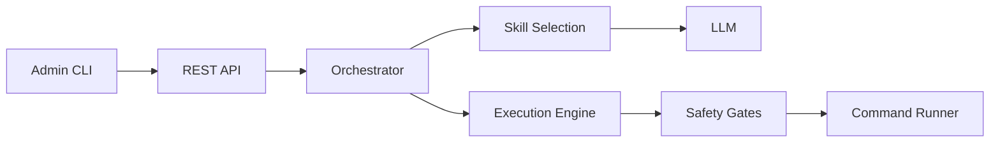

# InfraBrain

On-premise AI IT operations platform. Diagnoses infrastructure problems, plans fixes, executes them with human approval, and verifies results. Runs 100% locally using Ollama with local LLMs. No cloud dependencies, no telemetry.

## How It Works



InfraBrain follows a **Diagnose → Plan → Execute → Verify** loop. The orchestrator selects relevant skills, queries local LLMs for diagnosis and fix planning, then executes approved commands through a safety-gated execution engine. Every action is audited and reversible.

## Features

- **Diagnose → Plan → Execute → Verify** closed-loop remediation
- **Composable Markdown skill files** — teach it any system
- **Three-tier HITL approval** — read=auto, write=Y/N, destructive=typed confirmation
- **Command allowlist/blocklist** validation
- **Circuit breaker + damage budget** safety controls
- **Automatic rollback** on safety limit breach
- **Pre-execution state snapshots** for recovery
- **Sub-agent isolation** — separate LLM context and child process per execution
- **File-based target locking** with force-override
- **Dual-write state** — human-readable files + SQLite
- **Structured JSON audit trail** for compliance
- **Session resume** with retry/skip on interrupted plans
- **JSON output mode** (`--json`) for scripting and automation
- **TOON encoding** for LLM context optimization (32k context = ~50k+ effective tokens)
- **Iterative Discovery** — runs READ-only commands before LLM diagnosis to prevent hallucination
- **Multi-model registry** — routes tasks by domain expertise: Technical Lead (structured syntax), Forensic Specialist (deep reasoning), Strategic Fallback (broad knowledge). Skills can declare `preferred_model` in frontmatter
- **Log analysis** with format auto-detection (syslog, JSON, Docker, journald)
- **Dev-mode TOON analytics** — shows token savings in development

## Tech Stack

| Layer | Technology |
|-------|------------|
| Runtime | Node.js / TypeScript 5.9 (ESM) |
| LLM | AI SDK v6 + Ollama (multi-model registry: `infrabrain` Technical Lead, `deepseek-r1:32b` Forensic, `llama3.3:70b` Strategic) |
| Database | better-sqlite3 (state + audit) |
| API | Express 5 (REST) |
| CLI | Commander |
| Validation | Zod v4 |
| Testing | Vitest (322+ tests, 36 test files) |
| Build | tsup + tsx |

## Project Structure

```
src/
├── api/          # Express routes (health, debug, execute, status, history, resume)
├── audit/        # Structured JSON audit logger
├── cli/          # REPL, commands, approval gate, formatters
├── config/       # Configuration loader and types
├── execution/    # Executor, circuit breaker, damage budget, snapshot, rollback
├── llm/          # Provider abstraction, Ollama, token budget, TOON encoder
├── locks/        # File-based target locking
├── log-analysis/ # Log parsers and format detection
├── orchestrator/ # Skill router, fix plan generator, context builder
├── safety/       # Risk classifier, command validator, rules
├── skills/       # Skill loader, registry, format spec
└── state/        # SQLite store, session management, dual-write
```

## Getting Started

### Prerequisites

- Node.js 22+
- Ollama running locally with models configured in `.infrabrain/config.json`. The `modelMap` defines three roles:
  - `default`: `infrabrain` — Technical Lead (Qwen 2.5 Coder 32B, see `Modelfile`)
  - `strategic`: `llama3.3:70b` — Strategic Fallback
  - `forensic`: `deepseek-r1:32b` — Forensic Specialist

### Configure

```bash
cp config.example.json .infrabrain/config.json
# Edit .infrabrain/config.json with your Ollama URL and model names
```

### Install

```bash
npm install
```

### Run Tests

```bash
npm test
```

### Start Dev Server

```bash
npm run dev
```

### Build

```bash
npm run build
```

## CLI Commands

| Command | Description |
|---------|-------------|
| `/infra:debug "problem"` | Diagnose and fix an infrastructure problem |
| `/infra:execute` | Execute the fix plan from the last diagnosis |
| `/infra:status` | Show system status, active sessions, locks |
| `/infra:history` | Query audit log with filters |
| `/infra:resume` | Resume an interrupted fix plan |
| `/infra:health` | Check Ollama connectivity and models |

## API Endpoints

| Method | Path | Description |
|--------|------|-------------|
| GET | `/health` | Health check |
| GET | `/status` | System status |
| GET | `/history` | Audit log query |
| POST | `/debug` | Start diagnostic |
| POST | `/execute` | Execute fix plan |
| POST | `/resume` | Resume fix plan |

## Safety

InfraBrain enforces multiple layers of safety controls:

- **Three-tier human approval** — read operations auto-approve, write operations require Y/N, destructive operations require typed confirmation
- **Command allowlist/blocklist** — only pre-approved commands can execute
- **Circuit breaker** — configurable max retries before halting
- **Damage budget** — caps the number of state changes per fix session
- **Automatic rollback** — reverts changes on safety limit breach
- **Full audit trail** — every command, approval, and outcome is recorded

## License

ISC
